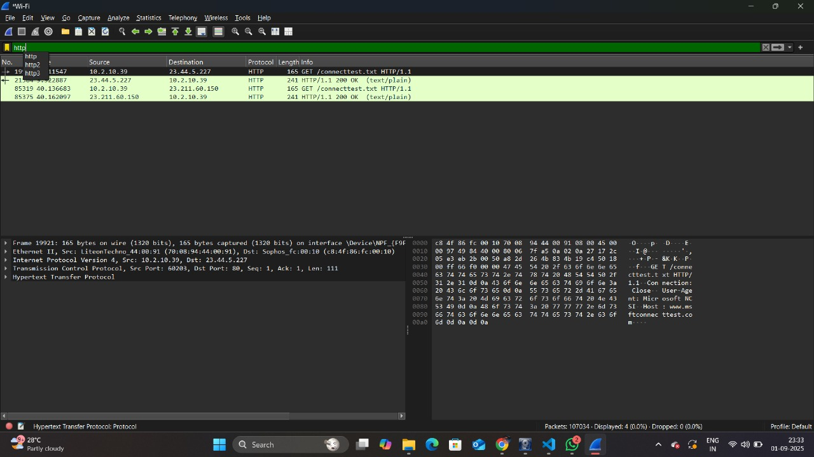

# Experiment 3: Capture and Analyze Network Traffic using Wireshark

## Aim
The purpose of this experiment is to learn how to capture and analyze network traffic using Wireshark, a widely used network protocol analyzer. The objective is to monitor and understand the data packets flowing into and out of a computer's network interface, providing insights into communication protocols, potential security issues, and network performance.

## Description
Wireshark is a powerful, open-source tool that allows for the real-time capture and interactive analysis of network packets. By putting the network interface into a "promiscuous mode," Wireshark can "sniff" or capture all data packets that are visible to it, not just those destined for the host machine. The captured data, known as a pcap file, can then be filtered, sorted, and examined to reveal details about the network traffic, including source and destination IP addresses, port numbers, protocols (like TCP, UDP, and HTTP), and the raw data payload of each packet. This process is fundamental for network troubleshooting, security analysis, and protocol development.

## Tools & Equipment Used
Computer: A workstation with a functioning network card.

Wireshark software: Downloaded and installed from the official Wireshark website.

Network Connection: An active internet connection (Wi-Fi or Ethernet).

Optional: An Ethernet switch that supports port mirroring for capturing traffic from other devices on the network.

## Procedure
Installation and Setup: Download and install Wireshark on your computer. During installation, you'll be prompted to install Npcap, a packet capture library necessary for Wireshark to function on Windows. Ensure you have administrative privileges to run the capture.

Select Network Interface: Launch Wireshark. The main screen will display a list of all detected network interfaces (e.g., Wi-Fi, Ethernet). A small graph next to each interface shows live network activity. Double-click the interface you want to monitor to start the capture.

Initiate Traffic: Once the capture begins, open a web browser and navigate to a website, or perform any network activity on your computer. This will generate network packets for Wireshark to capture. You'll see a flood of new packets appearing in the main window.

Stop Capture: After a few moments, click the red stop button in the top toolbar to halt the packet capture. This is a crucial step before analysis to freeze the data set.

Filter and Analyze: Use the display filter bar at the top to narrow down the captured traffic. For example, to see only web traffic, type http and press Enter. To see all traffic to a specific IP address, use ip.addr == 192.168.1.1. Click on a packet in the top pane to see its detailed information in the middle and bottom panes. The middle pane shows the protocol layers (e.g., Frame, Ethernet, IP, TCP, HTTP), and the bottom pane shows the raw data in hexadecimal and ASCII.

Examine a Packet: Right-click on a packet (for example, an HTTP GET request) and select "Follow" > "TCP Stream." This will open a new window showing the entire conversation between your computer and the web server, allowing you to see the full request and response, including the data sent and received.

## Result
The experiment successfully demonstrates how to capture, filter, and analyze network packets. By examining the captured traffic, you can see a complete picture of your network communications. You can identify the protocols being used, see the data being exchanged in plain text (if unencrypted), and pinpoint any unexpected or suspicious connections. The ability to view the TCP stream reveals the full conversation, which is invaluable for understanding how applications communicate over a network. The results prove that Wireshark is an essential tool for network diagnostics and security monitoring. The captured data provides concrete evidence of network activity that would otherwise be invisible.